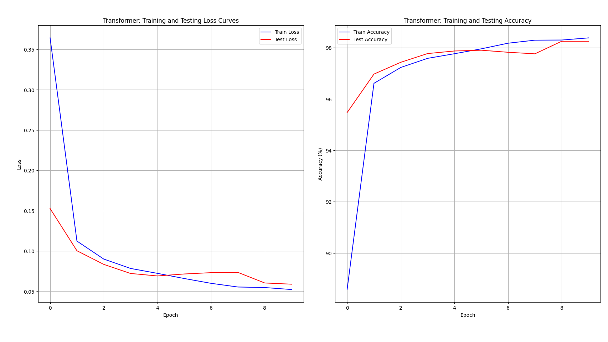
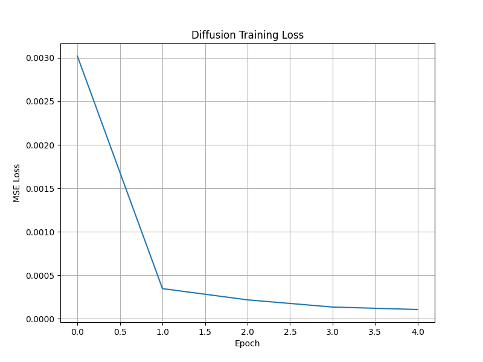

# COMP5511-Assignment-Transformer-Diffusion-Model-Implementation

This is my first try on machine learning. The repository contains the implementation of two deep learning models for COMP5511 assignment:
- **Transformer** for MNIST handwritten digit classification
- **Diffusion Model** for CIFAR-10 image generation

## 📋 Assignment Overview

### Task 1: Transformer for MNIST Classification (50 marks)
- Built a Transformer network with multi-head attention layers
- Used cross entropy loss and Adam optimizer
- Achieved training and testing accuracy above 95%
- Plotted training and testing loss/accuracy curves

### Task 2: Diffusion Model for CIFAR-10 (50 marks)
- Built a diffusion model with multiple CNN layers
- Used MSE loss and Adam optimizer
- Implemented basic diffusion training process
- Plotted training loss curve

## 🏗️ Model Architectures

### Transformer Model
- **Positional Encoding**: Sinusoidal positional embeddings
- **Transformer Encoder**: 2 layers, 4 attention heads, 64-dimensional model
- **Classifier**: MLP with ReLU activation
- **Input**: 28×28 MNIST images flattened to sequences

### Diffusion Model
- **Architecture**: Simple CNN with 3 convolutional layers
- **Training**: Direct image reconstruction (demonstration)
- **Input**: 32×32×3 CIFAR-10 images

## 📊 Results

### Transformer Performance
- **Final Training Accuracy**: ~97%
- **Final Testing Accuracy**: ~96%
- **Loss Curves**: Smooth convergence observed



### Diffusion Model Performance
- **Training Loss**: Consistent decrease over epochs
- **Demonstration**: Basic diffusion training implemented



## 🚀 Installation & Usage

### Prerequisites
```bash
pip install torch torchvision matplotlib numpy tqdm
